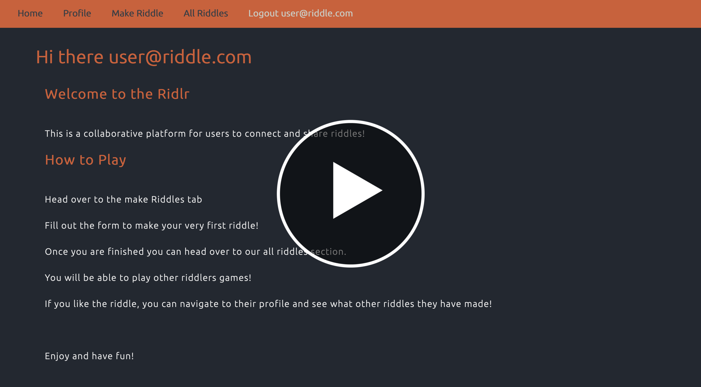
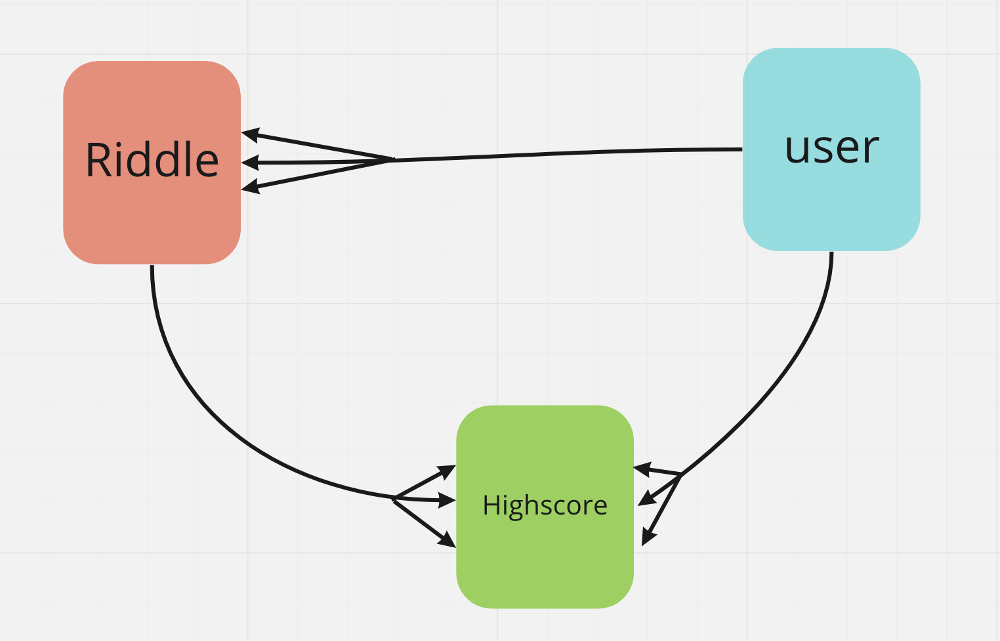

# Ridlr - A Riddle Repository

[Click Here](https://riddlingriddler.herokuapp.com/) to access the application.

**Info**

A project using CRUD systems inspired by scrabble and wordle. 

Developed a website on based on a CRUD system with 3 models whilst using one to many associations. 

The preface of the website is to create a community in which users can connect with other fellow users by creating riddles, posting it and have allowing others to be able to answer their riddles. 

Other riddlers scores are posted on a board where they rank their high scores on order by the fastest time.

Riddlers can also edit their profile and create their own bio and profile picture. A Riddlers profile also includes all other riddles they have made.

**How To Play**

1. Sign Up and log in

1. Head over to the make Riddles tab

1. Fill out the form to make your very first riddle!

1. Once you are finished you can head over to our all riddles section.

1. You will be able to play other riddlers games!

1. If you like the riddle, you can navigate to their profile and see what other riddles they have made!

1. Enjoy and have fun!


**Website Video Preview**

Click this image link to youtube for a video demo.

[](https://youtu.be/evxHLmFtDXs)

**Tech Stack**

* Ruby on Rails
* PostgreSQL
* Javascript & Jquery
* HTML5
* CSS
* Heroku

**Model**

This is the database model used for one to many associations. 

This allows websites to association database values from other models to promote better usability and interactivity in the application.



**Schema**

Code snippet of the schema showing the associating ids that are connected to each model.

```ruby

  create_table "riddles", force: :cascade do |t|
    t.text "question"
    t.text "answer"
    t.datetime "created_at", null: false
    t.datetime "updated_at", null: false
    t.integer "user_id"
    t.string "name"
  end

  create_table "scores", force: :cascade do |t|
    t.float "point"
    t.datetime "created_at", null: false
    t.datetime "updated_at", null: false
    t.integer "user_id"
    t.integer "riddle_id"
  end

  create_table "users", force: :cascade do |t|
    t.text "email"
    t.text "info"
    t.text "image"
    t.boolean "admin", default: false
    t.string "password_digest"
    t.datetime "created_at", null: false
    t.datetime "updated_at", null: false
  end

```

**Special Thanks**

To Joel and Loden for their insight and assistance with this project.

